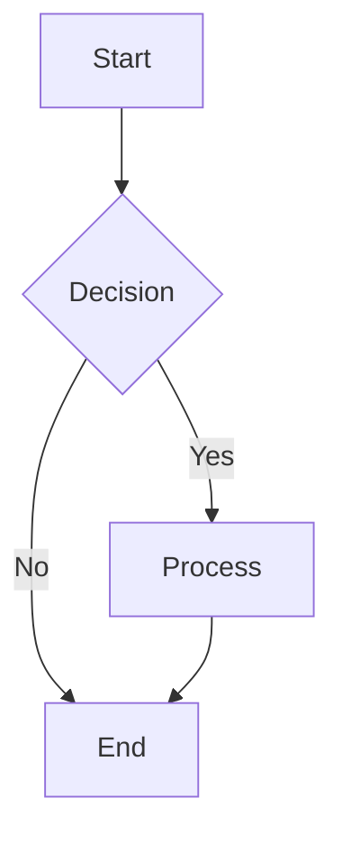
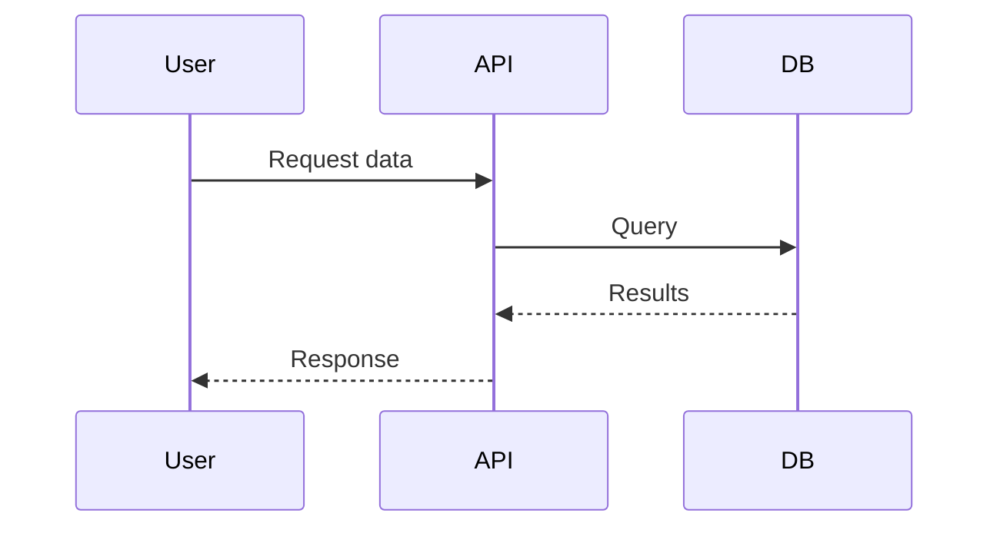
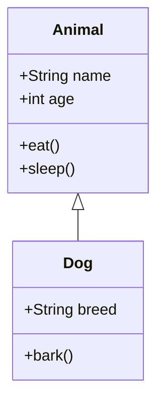

# Mermaid Diagram MCP Server

A Model Context Protocol (MCP) server that generates visual diagrams from Mermaid code using the Mermaid CLI tool. This server integrates with Claude Code to provide diagram generation capabilities directly in your conversations.

## Features

- **Generate diagrams** from Mermaid code in multiple formats (PNG, SVG, PDF)
- **Validate Mermaid syntax** before generation
- **Multiple themes** support (default, dark, forest, base)
- **Smart code extraction** from code blocks
- **Syntax guide resource** with common examples
- **Error handling** with helpful feedback

## Prerequisites

### 1. Install Node.js and npm
Make sure you have Node.js installed on your system. You can download it from [nodejs.org](https://nodejs.org/).

### 2. Install Mermaid CLI
The server requires the Mermaid CLI tool to generate diagrams:

```bash
npm install -g @mermaid-js/mermaid-cli
```

Verify the installation:
```bash
mmdc --version
```

### 3. Install MCP Python SDK
It's recommended to create a virtual environment first:

```bash
python3 -m venv venv
source venv/bin/activate  # On Windows: venv\Scripts\activate
```

Then install the MCP Python SDK:

```bash
pip install mcp
```

## Installation

1. **Clone or download this repository:**
   ```bash
   git clone <repository-url>
   cd mcp-mermaid-diagram
   ```

2. **Add the MCP server to Claude Code:**
   ```bash
   claude mcp add mermaid-diagram python '/full-path-to/mermaid_mcp_server.py'
   ```
   
   Replace `/full-path-to/mermaid_mcp_server.py` with the actual full path to the server file. Note that tilde (`~`) expansion doesn't work here, so you must use the complete absolute path.

   For user-level (global) configuration:
   ```bash
   claude mcp add -s user mermaid-diagram python '/full-path-to/mermaid_mcp_server.py'
   ```

3. **Verify the installation:**
   ```bash
   claude mcp list
   ```
   
   You should see `mermaid-diagram` listed as a connected server.

## Usage

### Generate Diagrams

Ask Claude to create diagrams using natural language:

```
"Can you create a flowchart showing a user login process?"
"Generate a sequence diagram for an API call"
"Show me a class diagram for a simple blog system"
```

Claude will automatically use the MCP server to generate the diagrams.

### Direct Tool Usage

You can also directly use the tools:

#### generate_diagram
```json
{
  "mermaid_code": "flowchart TD\n    A[Start] --> B[End]",
  "format": "svg",
  "theme": "default",
  "width": 1920,
  "height": 1080,
  "scale": 2,
  "backgroundColor": "transparent"
}
```

#### validate_mermaid
```json
{
  "mermaid_code": "graph TD\n    A --> B"
}
```

## Supported Diagram Types

The server supports all Mermaid diagram types:

- **Flowcharts**: `flowchart TD` or `graph TD`
- **Sequence Diagrams**: `sequenceDiagram`
- **Class Diagrams**: `classDiagram`
- **State Diagrams**: `stateDiagram-v2`
- **Entity Relationship Diagrams**: `erDiagram`
- **User Journey**: `journey`
- **Gantt Charts**: `gantt`
- **Pie Charts**: `pie title Chart Title`
- **Git Graphs**: `gitgraph`
- **And more!**

## Output Formats

- **SVG** (default): Returns SVG markup that can be embedded
- **PNG**: Generates a PNG image file
- **PDF**: Generates a PDF file

## Resolution & Quality Settings

For large or complex diagrams, you can customize the output resolution:

- **width**: Image width in pixels (800-4000, default: 1920)
- **height**: Image height in pixels (600-4000, default: 1080)
- **scale**: Scale factor for higher resolution (1-4, default: 2)

### High-Resolution Examples
```json
// For very large diagrams
{
  "width": 3840,
  "height": 2160,
  "scale": 3
}

// For detailed diagrams
{
  "width": 2560,
  "height": 1440,
  "scale": 2.5
}
```

## Themes

- **default** (default): Standard theme with dark text/lines (good for light backgrounds)
- **dark**: Custom dark theme with light text/lines (perfect for GitHub dark mode)
- **forest**: Green/forest theme
- **base**: Minimal base theme

### Theme Recommendations:
- **Light Environments (GitHub Light, IDEs with light themes)**: Use `theme: "default"` 
- **Dark Environments (GitHub Dark Mode, IDEs with dark themes)**: Use `theme: "dark"`
- **GitHub Universal Compatibility**: Use `theme: "default"` with transparent background (adapts automatically)
- **Custom Backgrounds**: Use any theme with your preferred `backgroundColor`

The "dark" theme uses light foreground colors (light grey text/lines) optimized for dark backgrounds, while "default" uses dark colors for light backgrounds.

## Background Colors

The default background color is `transparent` which adapts to your viewing environment (like GitHub's dark/light theme). You can customize this using the `backgroundColor` parameter:

- **transparent** (default): No background (adapts to container theme)
- **white**: White background for light themes
- **#0d1117**: GitHub dark theme background
- **#1f2020**: Mermaid dark theme background
- Custom hex colors (e.g., `#333333`)

## Examples

### Simple Flowchart


### Sequence Diagram


### Class Diagram


## Troubleshooting

### Server Not Starting
- Ensure the file path in the MCP configuration is correct
- Check that Python can find the MCP package: `python -c "import mcp"`
- Verify the server file has proper permissions

### Diagram Generation Fails
- Verify Mermaid CLI is installed: `mmdc --version`
- Check that the Mermaid syntax is valid
- Use the `validate_mermaid` tool to check syntax before generation

### Permission Issues
- Ensure the server has write permissions to the current directory
- Check that temporary file creation is allowed

### Debug Mode
Run Claude Code with debug mode to see detailed error messages:
```bash
claude --mcp-debug
```

## File Structure

```
mcp-mermaid-diagram/
├── mermaid_mcp_server.py    # Main MCP server file
├── README.md                # This file
└── generated_diagrams/      # Directory for generated files (created automatically)
```

## Contributing

Contributions are welcome! Please feel free to submit issues, feature requests, or pull requests.

## License

This project is open source. Please check the license file for details.

## Resources

- [Mermaid Documentation](https://mermaid.js.org/)
- [MCP Specification](https://spec.modelcontextprotocol.io/)
- [Claude Code Documentation](https://docs.anthropic.com/en/docs/claude-code)
- [Mermaid CLI Documentation](https://github.com/mermaid-js/mermaid-cli)